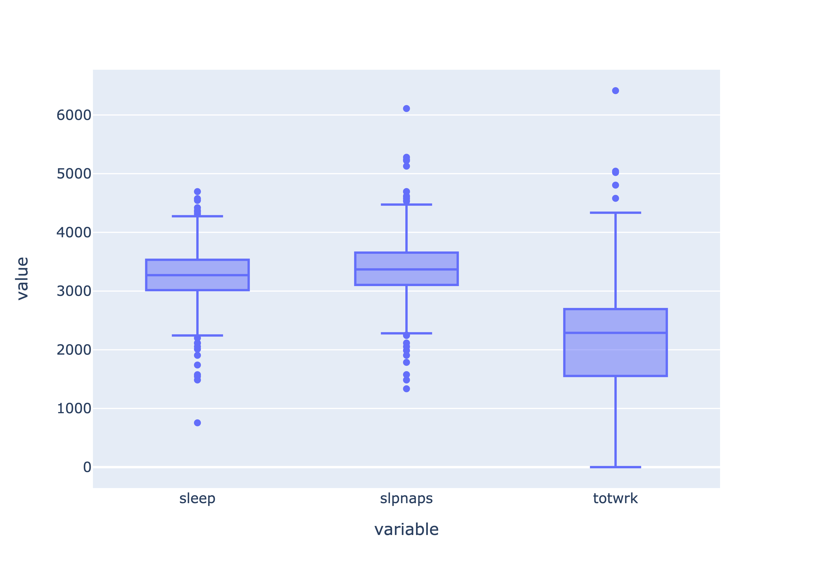
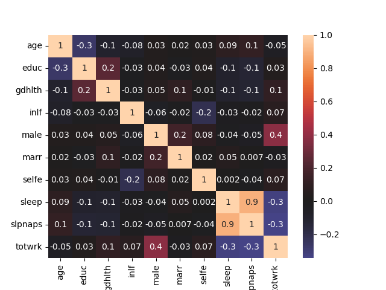
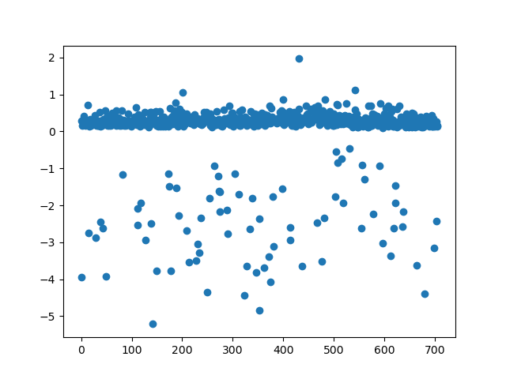
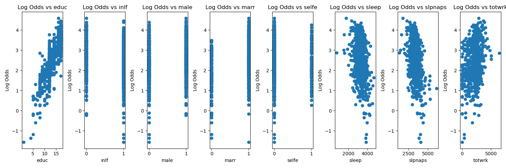
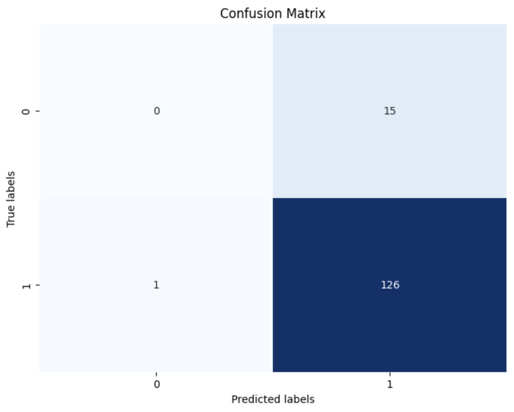

---

# Understanding Well-Being: How Demographic and Behaviors Shape Health

---

Huiting Chen,

Yijun Luo,

Ahmed Mostafa,

Justin Seo,

Sabrina Wang.

---

## Abstract

This study explores the intricate relationship between demographic characteristics, behavioral patterns, and individual well-being, with the goal of identifying key determinants of health status. Utilizing a dataset from Kaggle, we embark on a comprehensive analysis using a variety of predictive models including logistic regression and random forest, to uncover the factors that significantly impact an individual’s health status. Our research includes a wide range of variables such as sleep patterns, education level, employment status, marital status, and self-reported health status. Through logistic regression and random forest, we aim to explore the probabilistic and statistical relationship between these variables, the likelihood of good health based on these variables, and capture complex non-linear interactions between them. The findings from this research are expected to enhance our understanding of the multifaceted determinants of health and provide an effective model to predict individual well-being. Ultimately, this study aims to inform public health strategies and individual wellness practices, contributing to the improvement of health outcomes across diverse populations.

## 1 Introduction

In recent years, there has been a growing realization of the importance of health in ensuring a fulfilling and productive life. This heightened awareness has sparked a renewed interest in understanding the complex factors that contribute to well-being. Our study is situated within this context, aiming to unravel the intricate relationship between demographics, behaviors, and health outcomes. As public health challenges become increasingly heterogeneous, the need to comprehend these connections is more crucial than ever.
Our research seeks to explore how variables such as sleep patterns, age, education, employment status, influence an individual’s overall health. By leveraging advanced predictive models, including logistic regression and random forest, we strive to identify the key determinants of health and develop a robust model for predicting individual well-being.
This significance of this research extends beyond academic interest, as it holds the potential to inform targeted interventions and policy making. We analyzed a comprehensive dataset from Kaggle, our analysis aims to shed light on the complex nature of health determinants. Logistic regression and random forest allow us to assess the direct impact of each factor on health outcomes and capture interactions.
This study has practical implications, providing insights that can inform public health initiatives and personal wellness strategies. By identifying significant predictors of good health, we can contribute to the enhancement of population health and the formulation of effective health policies. As we analyze the topic, we anticipate to reveal valuable information that will enrich the academic discourse on health determinants and provide practical guidance for improving individual and community well-being.

## 2 Demographic and Behavioral Data
	
### 2.1 Data Source

Our dataset comes from Kaggle [1] and comprises characteristics and attributes of an individual within each row. Originally with 706 observations and 34 different demographic/behavioral variables, we refined the dataset to contain only 10 variables for later model training. The selected variables are all reasonable factors that we are interested in exploring as for the relationship between them and the health status variable. Variable description in a list format is as the following:  good health (gdhlth, equal to 1 if individual is in good or excellent health), age (age, in years), education (educ, years of schooling), marital status (marr, equal to 1 if the individual is married), self-employment status (selfe, equal to 1 if the individual is self-employed, sleep duration (sleep, minutes of sleep at night per week), sleep naps (slpnaps, minutes of sleep including naps per week), and total work time (totwrk, minutes worked per week).
Previous analyses on this dataset (and similar datasets) have predominantly focused on deciphering standard sleep patterns and their implications on health. Naimish Bohi et al. used this dataset to dive into categorizing different sleep patterns and understanding sleep behavior [2]. Alessandro Giacometti et al. used similar datasets to find most significant factors that affect sleep quality in order to provide personalized advice for their users’ health [3].

	
### 2.2 Exploratory Data Analysis

The exploratory data analysis phase of our research was designed to assess the structure, peculiarities, and patterns in the data. Before utilizing the dataset, we ensure a comprehensive evaluation without the interference of missing values, as confirmed by our initial missing values check, which returned zero missing values across all variables.
In our exploratory data analysis (EDA), the foundational stage commenced with meticulous data cleaning procedures. This critical step encompassed a thorough review aimed at verifying the accuracy of each variable's data type while simultaneously purging the dataset of any redundant or extraneous records. Through this rigorous cleaning process, our dataset underwent meticulous scrutiny, ensuring its integrity and completeness. Subsequently, a comprehensive assessment confirmed the absence of any missing values, signifying the robustness of our dataset. Moreover, the examination revealed that no adjustments to data types were warranted, further attesting to the pristine quality of our dataset.
Subsequently, we conducted visual exploratory analysis. The pairplot (Figure 1) generated a matrix of scatter plots that provided a pairwise comparison of the variables, with different colors indicating the status of self-reported health. These scatter plots revealed the distribution of each variable and the relationships between them, although no strong linear relationship was apparent between variables of our interest. The hue of good health indicated varying distributions on the two health status (good health or not), providing preliminary insights into potential factors associated with the gdhlth variable.

	
**Figure 1: Pairplot**

We employed box plots as a robust visualization tool to delve deeper into the distribution of three key variables: sleep duration, nap duration, and total work time (Figure 2). These plots served as effective means to scrutinize the data, particularly for detecting potential outliers. Upon examination, it was evident that sleep duration and nap duration exhibited relatively standard spreads, indicative of consistent patterns among respondents. Conversely, the box plot for total work time revealed a broader range, highlighting significant variability in working hours across the sampled population. Each variable was depicted through its individual box plot, where the box delineated the interquartile range (IQR), the median was represented by a central line, and the whiskers extended to encompass the minimum and maximum values within 1.5 times the IQR from the first and third quartiles. Leveraging the capabilities of the Plotly Express library, we integrated interactive features such as hover information and zooming functionalities into our plots. These enhancements facilitated a more dynamic exploration of the data encapsulated within the box plots, enabling a richer understanding of the underlying trends and patterns.

**Figure 2: Boxplot**

Utilizing the seaborn library, we crafted a visually informative heatmap (Figure 3) to unveil the intricate web of correlations within our dataset. Each cell of the heatmap was meticulously shaded to reflect the magnitude and directionality of the correlations, with a spectrum of colors denoting varying correlation strengths. Embedded within each cell were correlation coefficients, offering succinct insights into the relational dynamics between variables. This intuitive visualization served as a compass, guiding our exploration of inter-variable associations, particularly honing in on the strength and polarity of these correlations. Notably, the heatmap brought to light a robust positive correlation between sleep duration and nap duration, unveiling a significant relationship that would significantly influence our subsequent modeling endeavors. 

**Figure 3: Heatmap**
	

To conclude, EDA plays a pivotal role in the project serving as the foundation for understanding the underlying structure, patterns, and relationships within the dataset. Through techniques such as data visualization, summary statistics, and correlation analysis, EDA empowers us to make informed decisions regarding data preprocessing, feature engineering, and model selection. By uncovering insights and potential challenges early in the project lifecycle, EDA not only enhances the accuracy and reliability of the final machine learning model but also fosters a deeper understanding of the problem domain.

## 3 Predictive Model
	
### 3.1 Logistic Regression

The application of logistic regression in our study is predicated on its suitability for binary classification problems, which aligns with our research objective of predicting the likelihood of individuals being in good health. Logistic regression is particularly reasonable for our dataset because the response variable, representing health status, is a binary categorical variable (good health vs. not good health). Moreover, logistic regression does not assume a linear relationship between the independent variables and the response variable but rather a linear relationship between the log-odds of the response and the predictors, making it apt for our categorical outcome.

### 3.1.1 Assumptions and Model Diagnostics

In compliance with the assumptions underlying logistic regression, we first verified that the response variable follows a Bernoulli distribution. The variables of interest in our dataset (9 columns except our response variable ‘gdhlth’ listed in section 2.1) are all predictors for which we are predicting the probability of the outcome (good health). 
To satisfy the assumption that the residuals should be randomly distributed, we examined the scatter plots (Figure 4) of the residuals against the predicted probabilities and the fitted values. There is a clear pattern where most residuals cluster around 0 but then fan out as we move down the y-axis. This implies that the model fits certain ranges of the data well but less well as the value of the independent variable increases/decreases, leading to larger error. Despite the observed heteroscedasticity in the residuals, which suggests a potential violation of assumptions underlying logistic regression, we decided to proceed with the analysis. Our decision was motivated by the desire to explore the model’s capabilities and to understand the insights that could still be gleaned from it. Recognizing that real world data often presents such irregularities, we aimed to see how the model performed overall, which could still provide valuable information for interpreting the results and guiding future analyses.

	

**Figure 4: Residual Plot**
		

Upon fitting the logistic regression model, we assessed the linearity of the log-odds function against predictors. In plotting the log-odds against each predictor (Figure 5), we can see that all of our quantitative predictors chosen (education, sleep, sleep naps, and total work) show a roughly linear relationship with health status, which did not suggest any significant departure from the assumption.

	

**Figure 5: Log-odds against predictors**
		

The model's predictive power was further tested using the confusion matrix, Receiver Operating Characteristic (ROC) curve (Figure 6), and with an Area Under Curve (AUC) score of approximately 0.736. This score indicates a reasonable ability to discriminate between the two health status outcomes, with a value close to 1 being ideal. The confusion matrix shows the model has a high true positive rate (0.995) but a low true negative rate (0.091), suggesting that while the model is effective at identifying individuals in good health, it struggles to correctly predict those in poor health. This is also reflected in the high false positive rate (0.909), where individuals in poor health are frequently misclassified as healthy. The significant imbalance in predictive performance highlights the model’s limitations and suggests a need for improvement to ensure a balanced representation of health outcomes.

**Figure 6: ROC Curve**
	

Through our tests and observation, logistic regression proves to be a reasonable approach for our dataset but with limitations, allowing us to further refine a logistic regression model to draw meaningful insights into the determinants of health status.

### 3.1.2 Preprocessing, Modeling and Prediction
	
   To avoid multicollinearity and improve the model’s interpretability we chose to exclude the slpnaps variable from our primary predictors. Instead we engineered a new feature, ‘hadnap’, to denote whether napping is a behavior exhibited by the individual, thus retaining the essence of the data while simplifying the model’s complexity. This decision was aimed at refining the predictive power of our model without losing critical information that could influence the health outcomes.
   Following the preprocessing, the construction and training of the logistic regression model were executed with the intent to identify predictors of good health. The methodological approach was a forward selection process based on the Akaike Information Criterion (AIC), iteratively adding variables to our model and retaining those that contributed to a lower AIC score.
   Through this process, the variables ‘education’ (educ), ‘marital status’ (marr), and ‘total work time’ (totwrk) were identified as significant predictors and retained in the model initially. This selection was informed by a balance between model complexity and predictive performance, as indicated by the AIC. 
   Our initial version of the logistic regression model, which solely included main effects without interactions, did not perform optimally. This version likely failed to capture the complex interdependencies between variables, which can be crucial for accurately predicting health outcomes. In reality, the relationship between predictors and an individual’s health status is often not purely additive; instead, the effect of one variable can depend on the level of another. Ignoring these interactions can lead to oversimplified models that miss important patterns in the data.
   In response to the shortcomings of our first model, we introduce interaction terms between variables in the second version of the model. These terms allowed us to explore how the combination of different predictors affects the likelihood of reporting good health. For example, the interaction between age and napping behavior (‘age: hadnap’) provided new insights that were not apparent when considering them separately. The improved model with interaction terms exhibited better performance, suggesting that the relationship between certain predictors are multiplicative rather than additive. 
   To validate the robustness of our enhanced model, we conducted cross-validation, which is a resampling procedure used to evaluate a model if the data is limited. We repeatedly split the data into training and testing sets, and fitting and testing the model. The cross-validation results affirmed the superiority of the second model, confirming that incorporation of interactions between variables provided a more accurate and reliable representation of the factors influencing health outcomes.
   

**Figure 7: Confusion matrix**
	

   Lastly as part of model diagnostics, we scrutinized the confusion matrix at the decision threshold of 0.5. The results exhibited that we have successfully increased the true positive/negative rates, and decreased the false rates  (by 0.002 and 0.026 respectively). However, our model still has a high false positive rate and a low true negative rate. Although we valued the improvement of the model through our training, we are not satisfied with our final model’s predictive power, so we decided to take another approach, utilizing random forest classification.
	
### 3.2 Random Forest Classification
	
   After the poor performance of the logistic regression model, we decided to look for a better model that performs better on the current data. A good candidate for that was the Random Forest model. The Random Forest model is a great machine learning model that can work for both classification and regression problems. The model’s idea is that it is built with multiple decision trees and then votes are taken from each tree and based on these votes a prediction is produced. Each tree has its own distinct characteristics and therefore attempts to make a prediction from different perspectives. This limits bias and makes the model more robust. This approach is better suited for handling the intricate interactions between variables and the non-linearity within the data. 
   The dataset was split into a training set, which consisted of 80% of the data, and a testing set, which includes the remaining 20%. Stratification based on the outcome variables was employed to maintain the same proportion of the outcome variable in both sets, and a consistent random state was used for reproducibility. Moreover for preprocessing, we applied min-max scaling to numerical columns, adjusted by sex (male:0/1), ensuring that the scales were uniform across all groups without distorting existing differences in value ranges. Additionally we standardized the data by grouping to account for any potential group-specific effects on the measurement.
   A pipeline that included both the preprocessing steps and the classifier was constructed to ensure a smooth development. The model was then trained on our training data, and we used the classification report method provided by Sklearn library in python for evaluation. From the report, the precision, recall, and F1-scores were promising, with the model achieving an accuracy of 0.92 on the training data and 0.89 on the test data, suggesting good generalization from the model. Feature importance analysis post-model fitting showed that sleep and education were the most influential predictors, confirming our initial hypothesis in the proposal. The model parameters were initially chosen at random based on the researcher's expertise.. To further refine the model, we employed grid search with cross-validation to explore a range of hyperparameters systematically. Surprisingly, this intensive search did not yield a superior model to our initial configuration.

	

	
**Figure 8: Confusion matrix**

   The confusion matrix shown above (Figure 8) shows the performance of our model. Our model made 126 True Positive predictions, 15 False Positive predictions, and 1 False Negative prediction on the test set.
   The random forest model, with its ability to encapsulate complex structures in the data, proved to be a superior choice over logistic regression for this task. Its robust performance metrics and significant feature importances provide valuable insights into the dataset, allowing us to retain a relatively accurate model on predicting health status based on demographic and behavioral data.

	
## 4  Conclusion and Future Works
	
   This project’s evolution from logistic regression to random forest classification underscores the adaptability required for data analysis. Despite initial assumptions, logistic regression’s limitations necessitated a shift to a more complex model. The random forest approach yielded a more accurate predictive model which could help us draw more insightful results. The feature importance echoed our initial hypothesis, placid sleep and education as pivotal in predicting health outcomes. This not only validated our theoretical suppositions but also offered a tangible roadmap for potential policy implications, highlighting areas where intervention could be most impactful. This project showcases the necessity of an iterative, data-driven approach to model selection and the importance of aligning our modeling strategies with the patterns and characteristics our data holds. 
	For future works, we suggest investigations into determinants of sleep duration, which our analysis indicated as the most significant predictor of health status. Such studies could include examining lifestyle factors, stress levels, and even technology use and how they affect sleep. Optimizing leep may emerge as a key factor in promoting health, calling for policies that address sleep hygiene as a part of a comprehensive public health strategy. 

References

[1] Kapturov, Alexander. (2024). Sleep Patterns. Kaggle.
      https://www.kaggle.com/datasets/kapturovalexander/sleep-patterns
      
[2] Bohi, Naimish. (2024). Sleep Patterns with Pandas. Kaggle.
      https://www.kaggle.com/code/naimishbhoi/sleep-patterns-with-pandas
      
[3] Giacometti, Alessandro. (2024). Sleep Health Analysis-How to Sleep Better. Kaggle.
      https://www.kaggle.com/code/alessandrogiacometti/sleep-health-analysis-how-to-sleep-better

